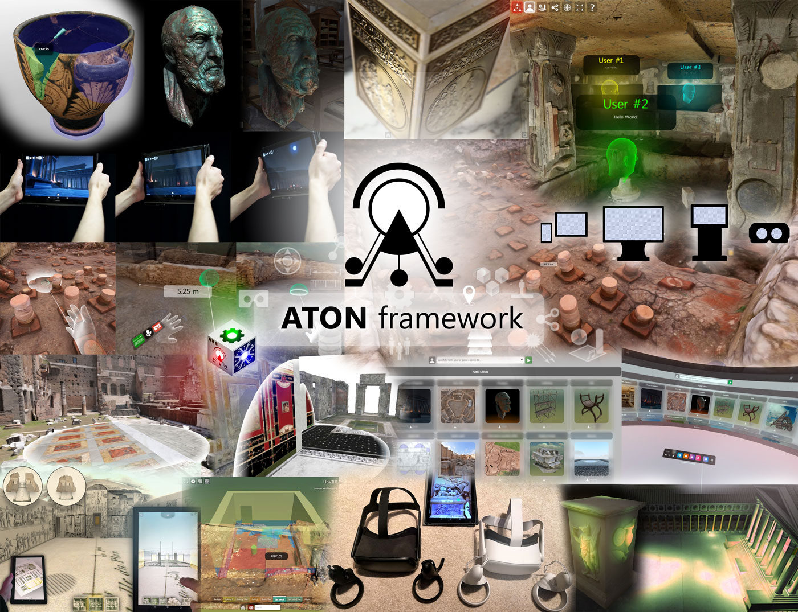

# ATON 3.0 framework

[Official ATON website](http://osiris.itabc.cnr.it/aton/) | 
[Telegram open-group](https://t.me/ATON_Framework) | 
[Live examples](https://aton.ispc.cnr.it/examples/) | 
[](https://heroku.com/deploy?template=https://github.com/phoenixbf/aton)



[ATON framework](http://osiris.itabc.cnr.it/aton/) - designed and developed by B. Fanini (CNR ISPC, ex ITABC) - allows to create scalable, collaborative and *cross-device* 3D Web-Apps (mobile, desktop and immersive VR) targeting Cultural Heritage exploiting modern web standards, without any installation required for final users. ATON offers:
* Responsive, adaptive and scalable presentation of interactive 3D content (mobile, desktop PCs, museum kiosks, immersive VR devices)
* Real-time collaborative multi-user features (*VRoadcast* module)
* Immersive VR (WebXR) for 3-DOF and 6-DOF devices
* Multi-resolution for massive 3D datasets through OGC standards
* Multi-touch interfaces
* Spatial UI (3D labels, buttons, etc...) targeting immersive XR sessions
* Built-in navigation modes, including *orbit*, *first-person*, *device-orientation* and *immersive VR*
* 3D semantic annotations including free-form volumetric shapes
* Fast, real-time 3D queries on visible graph, semantic graph and UI nodes
* Built-in Front-End ("Hathor") with WYSIWYG rich HTML5 annotation editor
* Built-in profiler (adapt presentation to different devices)
* Built-in service to access 3D collections and scenes
* Event-driven API for fully customizable events (local and synchronous collaborative contexts)
* 360 panoramas and virtual tours
* Physically-Based Rendering (PBR) for advanced materials and custom shaders for complex representations
* Advanced lighting, including IBL and Light Probes
* Camera/POV transitions, viewpoint handling and custom navigation constraints
* Complex scene-graph manipulation, hierarchical culling, instancing, composition and cascading transformations
* Scalable deployment, from low-cost SBCs (e.g. Raspberry Pi) to large infrastructures
* Multi-temporal (4D) visualization
* Dynamic and customizable recommendation systems

The framework also provides a *built-in* front-end and services based on [Node.js](https://nodejs.org/) for deployment on servers, infrastructures or single-board computers; real-time collaborative features through the *VRoadcast* component and support for remote/immersive visual analytics.

## Getting started (quick)
1) Install [Node.js](https://nodejs.org/) for your operating system.

2) Install or update ATON services (from root folder) by typing:
```
npm update
```

3) Deploy ATON *main service* on local machine simply using:
```
npm start
```

4) Open http://localhost:8080 on your browser.

# Citation
You can cite ATON framework using [this open-access publication](https://www.mdpi.com/2076-3417/11/22/11062) with the following BibTeX entry:
```
@article{fanini2021aton,
  title={ATON: An Open-Source Framework for Creating Immersive, Collaborative and Liquid Web-Apps for Cultural Heritage},
  author={Fanini, Bruno and Ferdani, Daniele and Demetrescu, Emanuel and Berto, Simone and d’Annibale, Enzo},
  journal={Applied Sciences},
  volume={11},
  number={22},
  pages={11062},
  year={2021},
  publisher={Multidisciplinary Digital Publishing Institute}
}
```

or - as software - using the Zenodo DOI [](https://doi.org/10.5281/zenodo.4618387) with the following BibTeX entry:
```
@software{aton2020_4618387,
  author       = {Bruno Fanini},
  title        = {ATON framework},
  year         = 2020,
  publisher    = {Zenodo},
  version      = {3.0},
  doi          = {10.5281/zenodo.4618387},
  url          = {https://doi.org/10.5281/zenodo.4618387}
}
```

# Publications
Main bibliographical reference (open access) of the framework is:

*Fanini, B., Ferdani, D., Demetrescu, E., Berto, S., & d’Annibale, E. (2021). [ATON: An Open-Source Framework for Creating Immersive, Collaborative and Liquid Web-Apps for Cultural Heritage](https://www.mdpi.com/2076-3417/11/22/11062). Applied Sciences, 11(22), 11062.*

You can find [here](http://osiris.itabc.cnr.it/aton/index.php/publications/) a complete list of publications where ATON was employed in different national and international projects.

# Contribute
You are more than welcome to contribute to the project by spotting bugs/issues and providing code or solutions through pull requests to fix or improve ATON functionalities (see TODO list below). Get in touch here on github, through the [telegram open-group](https://t.me/ATON_Framework) or through the other channels.

# TODO list

- [ ] Move and refactor 2D user interface routines from ATON.FE into ATON.UI component (2D labels, popup system, input search, etc.)
- [ ] Improve main landing page (public gallery), port to ejs and provide more customization
- [ ] Rewrite Hathor UI elements using new routines from ATON.UI.*
- [ ] Rewrite Shu using ejs
- [ ] Improve Shu UI (e.g. new scene, galleries) using new routines from ATON.UI