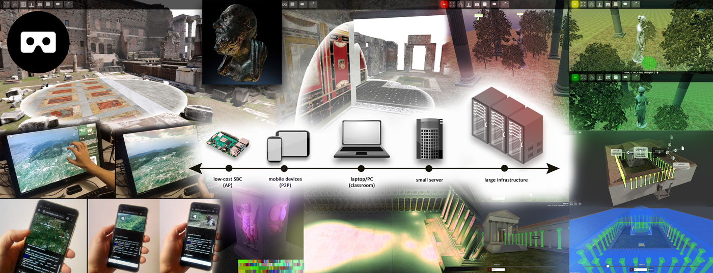

# ATON 2.0 framework (alpha)



The ATON 2.0 framework - developed by B. Fanini (CNR ISPC, ex ITABC) - allows to create scalable and *cross-device* 3D WebApps (mobile, desktop and immersive VR) exploiting modern web standards, without any installation required for the final user. ATON offers:
* Responsive, adaptive and scalable presentation of interactive 3D content (mobile, desktop/kiosks, immersive VR)
* Complex scene-graph manipulation and support for hierarchical culling, instancing, node composition and cascading transformations
* Immersive VR (WebVR/XR) and (multi)-touch devices interfaces
* Shape Descriptors for 3D semantic queries and annotations with customizable events
* Event-driven API
* Scalable deployment, from low-cost SBCs (e.g. Raspberry Pi) to large infrastructures
* Multi-temporal (4D) visualization
* Real-time collaborative multi-user features (*VRoadcast* module)
Paged multi-resolution
* Advanced multi-texturing, PBR features and shader customization
* Camera/POV transitions, custom POV handling and navigation constraints
* Dynamic and customizable recommendation systems
* Spherical panoramas and IBL

The framework also provides *built-in* services based on [Node.js](https://nodejs.org/) for deployment on servers, infrastructures or single-board computers; real-time collaborative features through the *VRoadcast* component and remote/immersive visual analytics.

## Getting started
1) Install [Node.js](https://nodejs.org/) for your operating system.

2) Install or update ATON services:
```
cd services/
npm update
```

3) From "services" folder, deploy ATON *content service* on local machine simply using:
```
node ATON.SERVICE.content.js
```

4) Open http://localhost:8080/s/hebe on your browser.

# Publications
Here is a list of publications where ATON was employed:

* B. Fanini, L. Cinque (2020) Encoding, Exchange and Manipulation of Captured Immersive VR Sessions for Learning Environments: the PRISMIN Framework. Applied Sciences 2020, 10, 2026. Special Issue “Emerging Artificial Intelligence (AI) Technologies for Learning”
* M. Lo Turco, P. Piumatti, M. Calvano, E. C. Giovannini, N. Mafrici, A. Tomalini, B. Fanini (2020). Interactive Digital Environments for Cultural Heritage and Museums. Building a digital ecosystem to display hidden collections. DISEGNARECON – ISSN 1828 5961
* Fanini, B., & Cinque, L. (2019). Encoding immersive sessions for online, interactive VR analytics. Virtual Reality, 1-16.
* Fanini, B., Pescarin, S., & Palombini, A. (2019). A cloud-based architecture for processing and dissemination of 3D landscapes online. Digital Applications in Archaeology and Cultural Heritage, e00100.
* Fanini, B., & Cinque, L. (2019, July). An Image-Based Encoding to Record and Track Immersive VR Sessions. In International Conference on Computational Science and Its Applications (pp. 299-310). Springer, Cham.
* Barsanti, S. G., Malatesta, S. G., Lella, F., Fanini, B., Sala, F., Dodero, E., & Petacco, L. (2018). The Winckelmann300 Project: Dissemination of Culture with Virtual Reality at the Capitoline Museum in Rome. International Archives of the Photogrammetry, Remote Sensing & Spatial Information Sciences, 42(2).
* Palombini, A., Fanini, B., Pagano, A. (2018, July). The Virtual Museum of the Upper Calore Valley. In International and Interdisciplinary Conference on Digital Environments for Education, Arts and Heritage (pp. 726-736). Springer, Cham.
* Fanini, B., & Cinque, L. (2018, October). Encoding VR sessions: image-based techniques to record and inspect immersive experiences. In 2018 3rd Digital Heritage International Congress (Digital Heritage) held jointly with 2018 24th International Conference on Virtual Systems & Multimedia (VSMM 2018) (pp. 1-8). IEEE.
* Meghini, C., Scopigno, R., Richards, J., Fanini, B., Wright, H., Geser, G., Cuy, S. et al. (2017). ARIADNE: a research infrastructure for archaeology. Journal on Computing and Cultural Heritage (JOCCH), 10(3), 18.
* Hollander, H. S., Aloia, N., Binding, C., Cuy, S., Doerr, M., Fanini, B., Meghini, C. et al. (2017). Enabling European Archaeological Research: The ARIADNE E-Infrastructure. Internet Archaeology, 17(43).
* Antal, A. and Bota, E. and Demetrescu, E. and Ciongradi, C. and and Fanini, B. and d'Annibale, E. and Dima, C. and Ferdani D. (2016). A complete workflow from the data collection on the field to the deployment of a Virtual Museum: the case of Virtual Sarmizegetusa.
